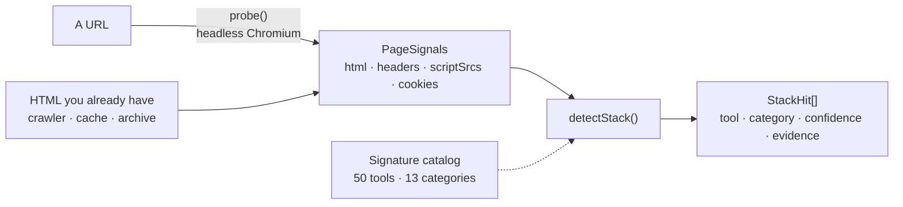
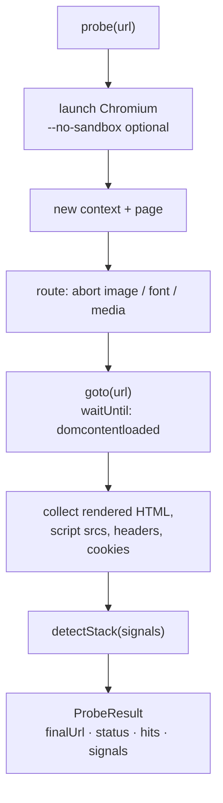
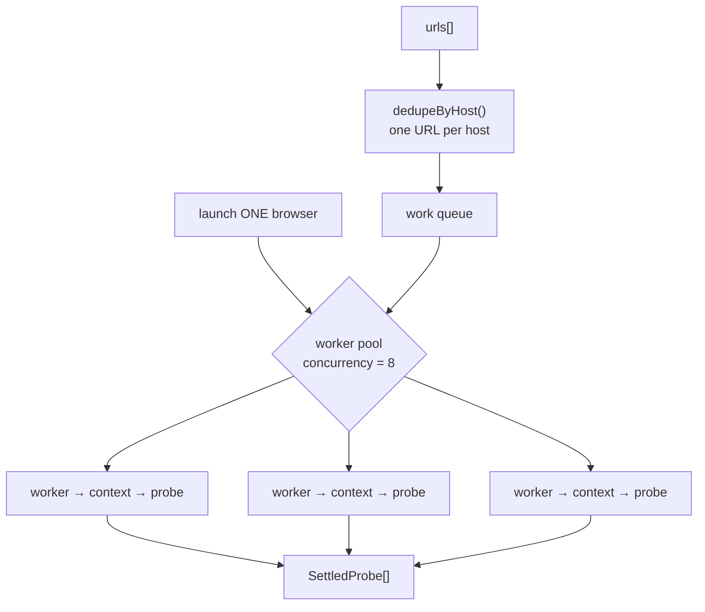
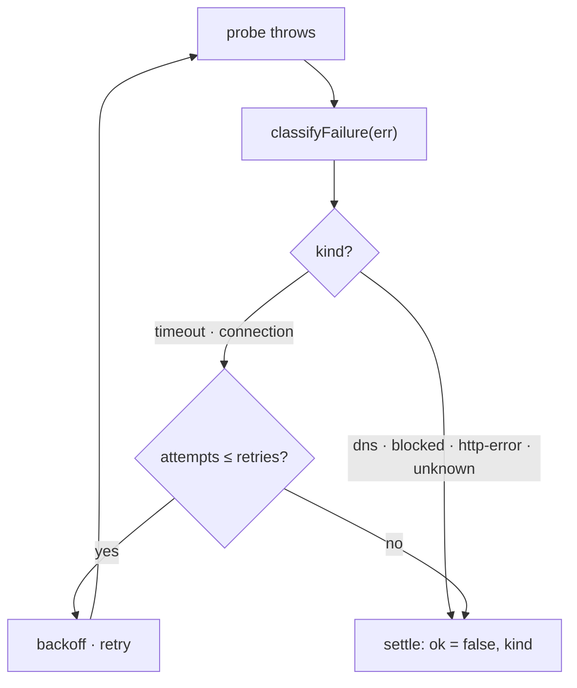
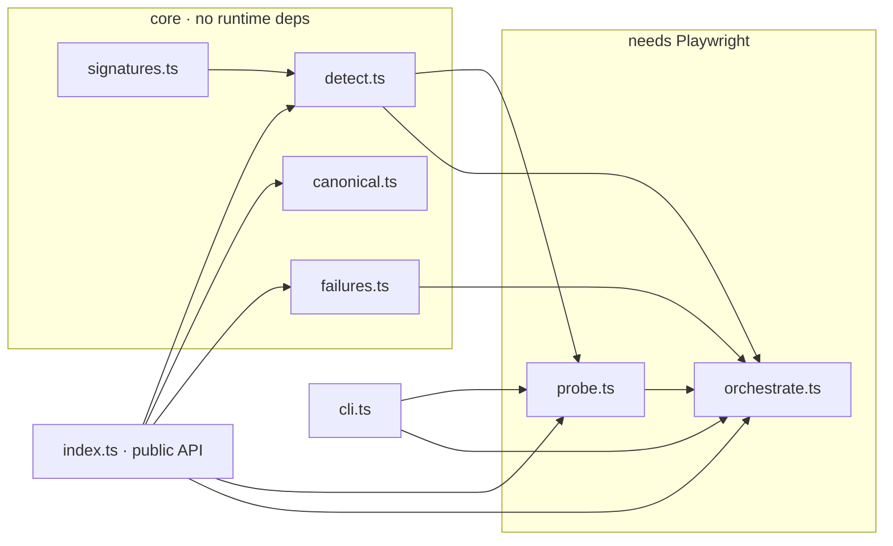

# stacksniff

[](https://github.com/JovanJevtic/stacksniff/actions/workflows/ci.yml)
[](./LICENSE)
[](#development)
[](./tsconfig.json)

Detect what SaaS and tech a website runs: booking tools, EHRs, a CMS, analytics, support and payment vendors, a CDN, an error monitor. It works off static signatures, with an optional headless Playwright fetch for when you only have a URL.

`detectStack()` is synchronous and has no dependencies. Give it whatever page signals you already have and it returns one hit per tool. If all you have is a URL, `probe()` fetches the signals with Playwright and feeds the same detector.

## Contents

- [Quick start](#quick-start)
- [How it works](#how-it-works)
- [Probing a live page](#probing-a-live-page)
- [Crawling many URLs](#crawling-many-urls)
- [Where this fits](#where-this-fits)
- [Seen in the wild](#seen-in-the-wild)
- [API reference](#api-reference)
- [Benchmarks](#benchmarks)
- [Project layout](#project-layout)
- [Development](#development)

## Quick start

```bash
npm install stacksniff
# Playwright is an optional peer dependency. Add it only if you call probe():
npm install playwright && npx playwright install chromium
```

```ts
import { detectStack, probe } from 'stacksniff';

// You already have the HTML (a crawler, a cache, an archive):
detectStack({ html: pageHtml, headers, scriptSrcs });
// -> [{ tool: 'stripe', category: 'payments', confidence: 'high', evidence: 'js.stripe.com' }, ...]

// You only have a URL. Let Playwright fetch the signals:
const { hits } = await probe('https://example.com');
```

From the command line:

```console
$ npx stacksniff https://gymshark.com

https://www.gymshark.com/  [200]

  cdn
    - cloudflare  (high)
  ecommerce
    - shopify  (high)
  tag-manager
    - google-tag-manager  (high)
```

That's an actual run, not a mock-up.

## How it works

There are two ways to feed one detector: pass `detectStack()` signals you already have, or let `probe()` pull them off a live page with Playwright.



Static signatures cover most of it. A request to `js.stripe.com`, `widget.intercom.io` or `cdn.shopify.com` is strong evidence, since you don't load a vendor's host by accident. The catch is that modern pages assemble a lot at runtime: scripts a tag manager injects, cookies set after hydration, widgets that only show up once the DOM settles. `probe()` renders the page and hands the rendered HTML, the live script `src` list, the response headers and the cookie names to the same `detectStack()`.

Every hit keeps the substring that matched, so you can check why a tool was flagged instead of taking the result on faith.

## Probing a live page

`probe()` is one self-contained page fetch: launch, load, collect, detect, close.



A few details it gets right:

- It waits on `domcontentloaded`, not `networkidle`. Analytics beacons keep a connection open, so `networkidle` tends to hang until it times out.
- It blocks images, fonts and media by default. The probe reads markup, not pixels, and dropping those requests saves bandwidth on big crawls.
- `noSandbox` is off unless you ask. You need it when running as root in a container, where Chromium's sandbox can't start; on a desktop you want the sandbox left on.

## Crawling many URLs

`probeMany()` runs a batch on a worker pool. It launches the browser once and gives each URL its own context, and by default it keeps one URL per host.



Every URL settles. A timeout, a dead DNS, a parked domain or a bot wall comes back as `{ ok: false }` with a `kind`, so one bad URL doesn't sink the batch. The `kind` is also what makes a retry sensible:



```ts
import { probeMany } from 'stacksniff';

const results = await probeMany(urls, {
  concurrency: 8,      // max pages in flight
  perHostOnce: true,   // one URL per host (default)
  retries: 1,          // retry transient failures only
  onSettled: (o) => {
    if (o.ok) console.log(o.url, o.result.hits.map((h) => h.tool));
    else console.warn(o.url, 'failed:', o.kind);
  },
});
```

`retries` only re-runs transient failures (timeout, connection). A dead DNS or a 403 fails once and moves on; retrying it wastes time and reads as hammering. `dedupeByHost()`, `classifyFailure()` and `isTransient()` are exported on their own and unit-tested.

## Where this fits

Same question behind a few different tasks: what is this domain actually running?

- Shadow-IT / SaaS discovery. Point it at a list of company domains, get back what SaaS each one exposes on the public web. A starting point before you dig into SSO logs or expense data.
- Vendor and access mapping. If a site runs Stripe, Intercom or a particular EHR, you know which vendors it leans on.
- Integration targeting. If you maintain automations against a lot of SaaS products, knowing which ones a site uses comes first.
- Competitive research. Same signal, pointed at a market instead of your own estate.

Pipe a domain list in and get a JSON or CSV inventory:

```console
$ printf 'gymshark.com\ntechcrunch.com\nlinear.app\n' | npx stacksniff --batch
[
  { "url": "https://gymshark.com",   "tools": ["google-tag-manager", "cloudflare", "shopify"] },
  { "url": "https://techcrunch.com", "tools": ["google-analytics", "microsoft-clarity", "wordpress", "google-tag-manager"] },
  { "url": "https://linear.app",     "tools": ["stripe", "cloudflare"] }
]

$ npx stacksniff --batch domains.txt --csv --retries 1 > inventory.csv
```

## Seen in the wild

Real `probe()` runs against well-known sites, nothing cherry-picked:

| Site | Detected |
| --- | --- |
| gymshark.com | `shopify` · `cloudflare` · `google-tag-manager` |
| techcrunch.com | `wordpress` · `google-analytics` · `microsoft-clarity` · `google-tag-manager` |
| linear.app | `stripe` · `cloudflare` |
| stripe.com | `stripe` |

## API reference

### `detectStack(signals): StackHit[]`

Synchronous, no dependencies. Pass any subset of the signals you have.

```ts
interface PageSignals {
  html?: string | null;         // rendered or raw HTML
  headers?: Record<string, string | string[] | undefined> | null;
  scriptSrcs?: string[] | null; // src of every <script> tag
  cookies?: string[] | null;    // names of cookies the page set
  cms?: string | null;          // a CMS captured out-of-band, mapped directly
}

interface StackHit {
  tool: string;            // 'stripe', 'wordpress', 'calendly', ...
  category: StackCategory; // see the 13 categories below
  confidence: 'high' | 'medium' | 'low';
  evidence: string;        // the matched substring, capped at 200 chars
}
```

Categories (`StackCategory`): `analytics`, `booking`, `cdn`, `cms`, `ecommerce`, `ehr`, `error-monitoring`, `forms`, `marketing`, `payments`, `support`, `tag-manager`, `video`.

`groupByCategory(hits)` buckets a result set by category.

### `probe(url, options?): Promise<ProbeResult>`

```ts
interface ProbeOptions {
  timeoutMs?: number;       // navigation timeout, default 20000
  userAgent?: string;       // defaults to a current desktop Chrome UA
  proxy?: { server: string; username?: string; password?: string };
  blockResources?: boolean; // block images/fonts/media, default true
  noSandbox?: boolean;      // --no-sandbox for containers / root
}
```

Playwright is imported dynamically, so importing `stacksniff` never pulls a browser binary unless you actually call `probe()`.

### `probeMany(urls, options?): Promise<SettledProbe[]>`

Everything in `ProbeOptions`, plus:

```ts
interface ProbeManyOptions extends ProbeOptions {
  concurrency?: number;     // max pages in flight, default 8
  perHostOnce?: boolean;    // one URL per host, default true
  retries?: number;         // extra attempts for transient failures, default 0
  retryBackoffMs?: number;  // base backoff × attempt, default 500
  onSettled?: (o: SettledProbe, i: number) => void;
}

type SettledProbe =
  | { url: string; ok: true;  result: ProbeResult; attempts: number }
  | { url: string; ok: false; error: Error; kind: FailureKind; attempts: number };

type FailureKind = 'timeout' | 'dns' | 'connection' | 'blocked' | 'http-error' | 'unknown';
```

### Helpers

```ts
import {
  groupByCategory, classifyFailure, isTransient, dedupeByHost, parseUrlList,
  normalizeName, extractCity, canonicalKey,
} from 'stacksniff';
```

The canonicalization helpers dedupe the same organisation seen across sources, when the name shows up with different legal suffixes, casing or diacritics. Folding is tuned for South-Slavic names (č, ć, đ, š, ž):

```ts
normalizeName('Klinika Sanus d.o.o.');           // 'sanus'
extractCity('Zmaja od Bosne 7, Sarajevo 71000'); // 'sarajevo'
canonicalKey('Studio Sanus', 'Ferhadija 5, Sarajevo'); // 'studio sanus__sarajevo'
```

## Benchmarks

`npm run build && npm run bench`.

`detectStack()` is cheap. On a 24 KB page it does roughly 2,000–3,000 pages/sec on one core (Node 20, a mid-range laptop), well under a millisecond each. Detection isn't the bottleneck; the network is.

`probeMany()` launches Chromium once for the whole batch and runs each URL in its own context, so a batch of N sites doesn't pay N cold starts.

The `probe`/`probeMany` wall-clock times depend on your connection and the target sites, not on this library, so they won't reproduce across machines. The repo ships the benchmark (`bench/bench.mjs`) rather than a fixed number: it measures detection throughput, the resource-blocking trade-off, and serial vs pooled crawl time against live sites.

## Project layout



The core (`detect`, `signatures`, `canonical`, `failures`) has no runtime dependencies and is what the tests cover. Only `probe` and `orchestrate` touch Playwright, and only when called.

## Development

```bash
npm test        # vitest — 47 cases, no browser needed
npm run build   # tsc -> dist/
npm run bench   # detection throughput + live crawl timing
```

Node 20+. The tests run on string fixtures, so no network or browser is involved. CI runs them on Node 20 and 22.

## Where it came from

I pulled the tech-detection part out of an internal lead-gen tool I built, and rewrote it as a standalone library with none of the business data attached. Built by [Jovan Jevtić](https://jjovan.com).

## License

MIT © Jovan Jevtić
