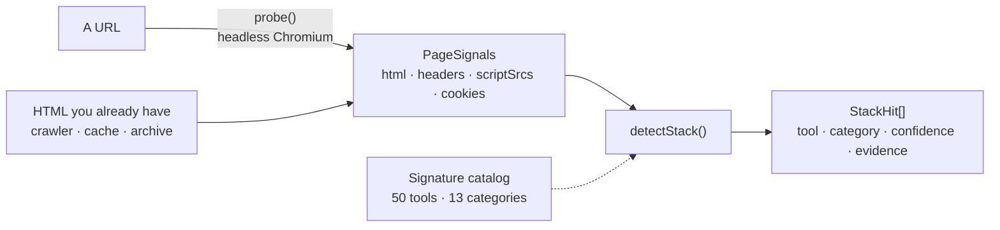
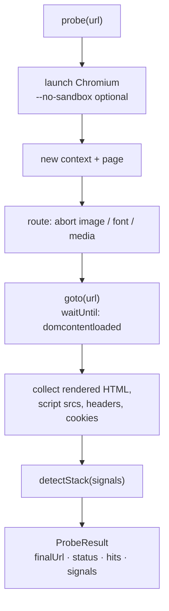
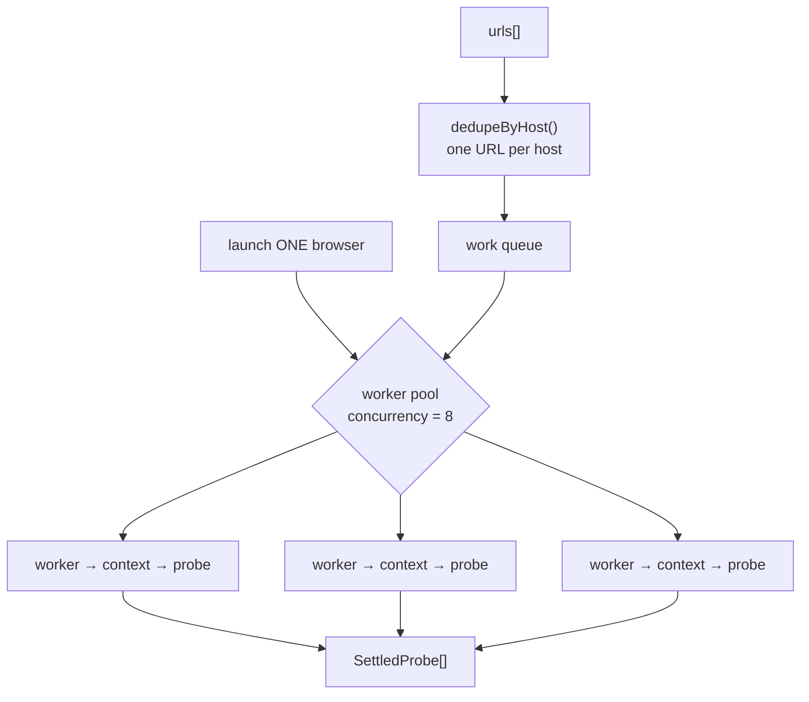
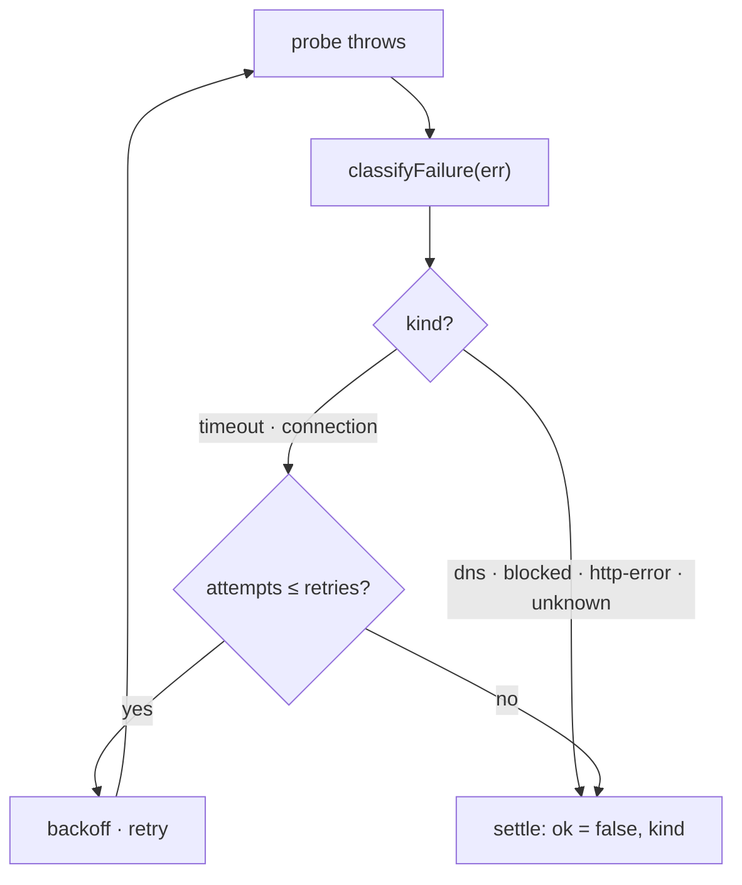

# stacksniff

[](https://github.com/JovanJevtic/stacksniff/actions/workflows/ci.yml)
[](./LICENSE)
[](#requirements)
[](./tsconfig.json)

**Detect the SaaS and tech stack a website runs** — a booking tool, an EHR, a CMS, an analytics, support or payment vendor, a CDN, an error monitor — from **static signatures** plus an optional **headless Playwright probe**.

The detection core is synchronous and dependency-free: hand it whatever page signals you already have and it returns one deduplicated hit per tool. When you have only a URL, `probe()` fetches the signals with a real browser. It's the "what is this domain actually running?" question — the one behind shadow-IT discovery, vendor mapping, and integration targeting.

## Contents

- [Quick start](#quick-start)
- [How it works](#how-it-works)
- [Probing a live page](#probing-a-live-page)
- [Crawling many URLs](#crawling-many-urls)
- [Where this fits](#where-this-fits)
- [Seen in the wild](#seen-in-the-wild)
- [API reference](#api-reference)
- [Benchmarks](#benchmarks)
- [Project layout](#project-layout)
- [Development](#development)

## Quick start

```bash
npm install stacksniff
# Playwright is an optional peer dependency — add it only if you use probe():
npm install playwright && npx playwright install chromium
```

```ts
import { detectStack, probe } from 'stacksniff';

// 1. You already have the HTML (from a crawler, a cache, an archive):
detectStack({ html: pageHtml, headers, scriptSrcs });
// -> [{ tool: 'stripe', category: 'payments', confidence: 'high', evidence: 'js.stripe.com' }, ...]

// 2. You have only a URL — let Playwright fetch the signals:
const { hits } = await probe('https://example.com');
```

Or from the command line, no code required:

```console
$ npx stacksniff https://gymshark.com

https://www.gymshark.com/  [200]

  cdn
    - cloudflare  (high)
  ecommerce
    - shopify  (high)
  tag-manager
    - google-tag-manager  (high)
```

That output is a real run, not a mock-up.

## How it works

Two ways to feed **one** detector. Either give `detectStack()` signals you already have, or let `probe()` fetch them from a live page with Playwright — both converge on the same signature matcher.



**Why two layers.** Static signatures are cheap and catch most of it: you don't load `js.stripe.com`, `widget.intercom.io` or `cdn.shopify.com` by accident, so a request to a vendor's host is high-confidence evidence. But much of a modern page is assembled at runtime — scripts injected by a tag manager, cookies set after hydration, widgets that only appear once the DOM settles. `probe()` renders the page and hands the **rendered** HTML, the live script `src` list, the response headers and the cookie names to the exact same `detectStack()`. One detector, two ways to feed it.

Every hit carries the substring that matched, so a result is **auditable** — you see *why* a tool was flagged, not just that it was.

## Probing a live page

`probe()` is a single, self-contained page fetch: launch, load, collect, detect, close.



Three choices separate this from a toy fetch:

- **`domcontentloaded`, not `networkidle`.** Analytics beacons keep a connection warm indefinitely, so `networkidle` routinely times out on live sites. Waiting on a concrete lifecycle event is faster and far more reliable.
- **Resource blocking by default.** The probe reads structure, not pixels. Aborting images, fonts and media at the network layer saves real bandwidth and time on image-heavy pages and large crawls.
- **`noSandbox` is opt-in.** In a container running as root, Chromium's setuid sandbox can't initialise and launches fail without `--no-sandbox`; on a normal desktop you keep the sandbox, so it's off unless you ask.

## Crawling many URLs

`probeMany()` fans a batch across a bounded worker pool, launching the browser **once** and running each URL in its own context. Browser launch is the expensive part — paying it per URL is what makes a naive crawler slow.



Every URL **settles** — a dead DNS, parked domain, timeout or bot wall becomes `{ ok: false }` instead of rejecting the whole run. And every failure is **classified**, which is what makes retrying safe:



```ts
import { probeMany } from 'stacksniff';

const results = await probeMany(urls, {
  concurrency: 8,      // max pages in flight
  perHostOnce: true,   // one URL per host (default)
  retries: 1,          // retry transient failures only (timeout, connection)
  onSettled: (o) => {  // stream results as they land
    if (o.ok) console.log(o.url, o.result.hits.map((h) => h.tool));
    else console.warn(o.url, 'failed:', o.kind);
  },
});
```

`retries` re-attempts only *transient* failures; a dead DNS or a bot wall fails once and moves on, because retrying it just wastes time and looks like hammering. `dedupeByHost()`, `classifyFailure()` and `isTransient()` are all exported standalone and unit-tested.

## Where this fits

"What is this domain actually running?" is the same question behind several jobs:

- **Shadow-IT / SaaS discovery** — point it at a list of company domains and get a per-domain inventory of the SaaS each exposes on the public web. A first pass at "what are we actually using", before touching SSO logs or expense data.
- **Access & vendor mapping** — knowing a site runs Stripe, Intercom, a specific EHR or booking tool tells you which vendors an org depends on, and which integrations matter.
- **Integration targeting** — when you maintain automations against hundreds of SaaS products, detecting which ones a site uses is step zero.
- **Competitive / market research** — the same signal, aimed at a market instead of your own estate.

Feed a domain list straight in and get a JSON or CSV inventory:

```console
$ printf 'gymshark.com\ntechcrunch.com\nlinear.app\n' | npx stacksniff --batch
[
  { "url": "https://gymshark.com",   "tools": ["google-tag-manager", "cloudflare", "shopify"] },
  { "url": "https://techcrunch.com", "tools": ["google-analytics", "microsoft-clarity", "wordpress", "google-tag-manager"] },
  { "url": "https://linear.app",     "tools": ["stripe", "cloudflare"] }
]

$ npx stacksniff --batch domains.txt --csv --retries 1 > inventory.csv
```

## Seen in the wild

Real `probe()` results against well-known sites — nothing hand-picked or mocked:

| Site | Detected |
| --- | --- |
| gymshark.com | `shopify` · `cloudflare` · `google-tag-manager` |
| techcrunch.com | `wordpress` · `google-analytics` · `microsoft-clarity` · `google-tag-manager` |
| linear.app | `stripe` · `cloudflare` |
| stripe.com | `stripe` |

## API reference

### `detectStack(signals): StackHit[]`

Synchronous, dependency-free. Pass any subset of the signals you have.

```ts
interface PageSignals {
  html?: string | null;         // rendered or raw HTML
  headers?: Record<string, string | string[] | undefined> | null;
  scriptSrcs?: string[] | null; // src of every <script> tag
  cookies?: string[] | null;    // names of cookies the page set
  cms?: string | null;          // a CMS captured out-of-band, mapped directly
}

interface StackHit {
  tool: string;            // 'stripe', 'wordpress', 'calendly', ...
  category: StackCategory; // see the 13 categories below
  confidence: 'high' | 'medium' | 'low';
  evidence: string;        // the matched substring, capped at 200 chars
}
```

**Categories** (`StackCategory`): `analytics` · `booking` · `cdn` · `cms` · `ecommerce` · `ehr` · `error-monitoring` · `forms` · `marketing` · `payments` · `support` · `tag-manager` · `video`.

`groupByCategory(hits)` buckets a result set by category for rendering or summarising.

### `probe(url, options?): Promise<ProbeResult>`

```ts
interface ProbeOptions {
  timeoutMs?: number;       // navigation timeout, default 20000
  userAgent?: string;       // defaults to a current desktop Chrome UA
  proxy?: { server: string; username?: string; password?: string };
  blockResources?: boolean; // block images/fonts/media, default true
  noSandbox?: boolean;      // --no-sandbox for containerised/root runs
}
```

Playwright is imported dynamically, so importing `stacksniff` never pulls a browser binary unless you actually call `probe()`.

### `probeMany(urls, options?): Promise<SettledProbe[]>`

Everything in `ProbeOptions`, plus:

```ts
interface ProbeManyOptions extends ProbeOptions {
  concurrency?: number;     // max pages in flight, default 8
  perHostOnce?: boolean;    // one URL per host, default true
  retries?: number;         // extra attempts for transient failures, default 0
  retryBackoffMs?: number;  // base backoff × attempt, default 500
  onSettled?: (o: SettledProbe, i: number) => void;
}

type SettledProbe =
  | { url: string; ok: true;  result: ProbeResult; attempts: number }
  | { url: string; ok: false; error: Error; kind: FailureKind; attempts: number };

type FailureKind = 'timeout' | 'dns' | 'connection' | 'blocked' | 'http-error' | 'unknown';
```

### Helpers

```ts
import {
  groupByCategory, classifyFailure, isTransient, dedupeByHost, parseUrlList,
  normalizeName, extractCity, canonicalKey,
} from 'stacksniff';
```

The canonicalization helpers dedupe the same organisation seen across sources, where names arrive with different legal suffixes, casing and diacritics. Diacritic folding is tuned for South-Slavic names (č, ć, đ, š, ž):

```ts
normalizeName('Klinika Sanus d.o.o.');           // 'sanus'
extractCity('Zmaja od Bosne 7, Sarajevo 71000'); // 'sarajevo'
canonicalKey('Studio Sanus', 'Ferhadija 5, Sarajevo'); // 'studio sanus__sarajevo'
```

## Benchmarks

Run them yourself: `npm run build && npm run bench`.

**Detection is effectively free.** The pure `detectStack()` path — run once per page, potentially millions of times — clears a 24 KB page in **well under a millisecond**: roughly **2,000–3,000 pages/sec on a single core** (Node 20, mid-range laptop). Detection is never the bottleneck; the network is.

**The browser cost is paid once per batch, not once per page.** `probeMany` launches Chromium a single time and runs each URL in its own context, so a batch of *N* sites doesn't pay *N* cold browser starts.

The `probe`/`probeMany` wall-clock numbers are network-bound — they depend on your connection and the target sites, not on this library — so this repo ships the reproducible benchmark rather than a screenshot of numbers that wouldn't reproduce on your machine. `bench/bench.mjs` measures detection throughput, the resource-blocking trade-off, and serial-vs-pooled crawl time against live sites.

## Project layout


The core (`detect`, `signatures`, `canonical`, `failures`) has **zero runtime dependencies** and is what the test suite covers. `probe` and `orchestrate` are the only modules that touch Playwright, and only at call time.

## Development

```bash
npm test        # vitest — 47 cases, no browser required
npm run build   # tsc -> dist/
npm run bench   # detection throughput + live crawl timing
```

<a name="requirements"></a>Requires Node ≥ 20. The detection and orchestration logic is covered by unit tests over fixtures — no network, no browser — so the core stays fast to verify and safe to change. CI runs the suite on Node 20 and 22.

## Provenance

Extracted and generalized from the tech-detection layer of an internal lead-intelligence tool, rewritten as a standalone library with no business data attached. Built by [Jovan Jevtić](https://jjovan.com).

## License

MIT © Jovan Jevtić
